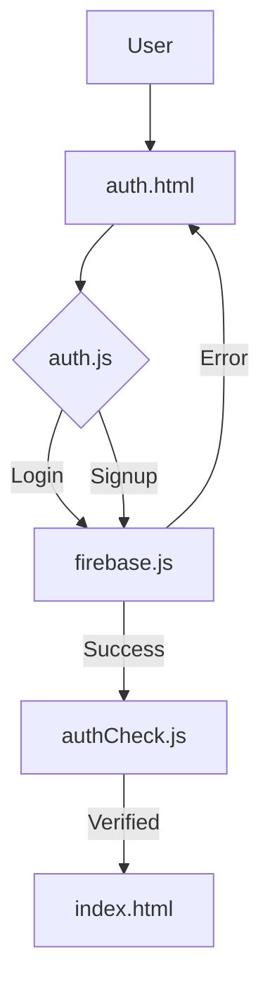
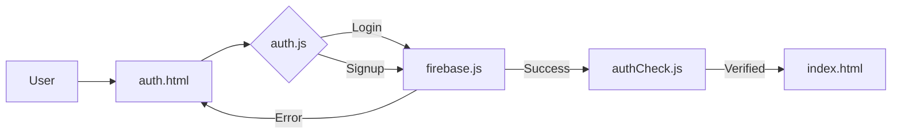
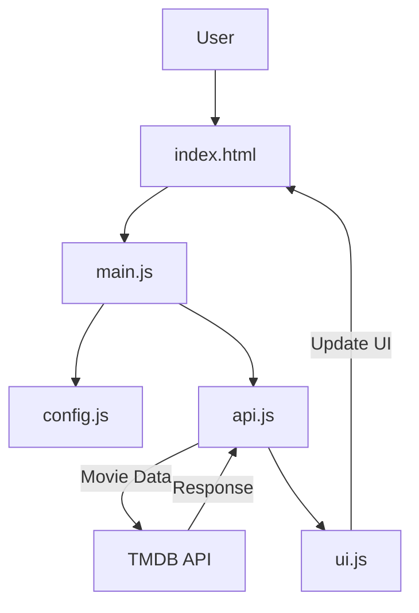

# Application Structure and Data Flow

## 1. Authentication System

### 1.1 File Structure
```
Authentication/
├── auth.html          # Login and signup interface
├── auth.css           # Authentication styling
├── auth.js           # Authentication logic
└── src/
    ├── firebase.js   # Firebase configuration
    └── authCheck.js  # Session verification
```

### 1.2 Data Flow



### 1.2 Data Flow



### 1.3 Key Components

#### 1.3.1 Authentication Interface (auth.html)
```html
<!-- Login Form -->
<form id="loginForm" class="auth-form glass-form">
    <input type="email" placeholder="Email" required>
    <input type="password" placeholder="Password" required>
    <button type="submit">Login</button>
</form>

<!-- Registration Form -->
<form id="signupForm" class="auth-form glass-form">
    <input type="email" placeholder="Email" required>
    <input type="password" placeholder="Password" required>
    <button type="submit">Sign Up</button>
</form>
```

#### 1.3.2 Authentication Logic (auth.js)
```javascreipt
// Firebase Authentication
import { auth } from './src/firebase.js';
import { 
    createUserWithEmailAndPassword,
    signInWithEmailAndPassword 
} from 'firebase/auth';

// Login Handler
const handleLogin = async (email, password) => {
    try {
        await signInWithEmailAndPassword(auth, email, password);
        window.location.href = '/index.html';
    } catch (error) {
        handleAuthError(error);
    }
};

// Session Check (authCheck.js)
const checkAuth = () => {
    auth.onAuthStateChanged(user => {
        if (!user) window.location.href = '/auth.html';
    });
};
```

## 2. Main Website

### 2.1 File Structure
```
Main Website/
├── index.html        # Main application interface
├── style.css         # Global styles
├── main.js          # Core application logic
└── src/
    ├── api.js       # TMDB API integration
    ├── config.js    # Application configuration
    ├── ui.js        # UI updates
    └── utils.js     # Helper functions
```

### 2.2 Data Flow


### 2.3 Key Components

#### 2.3.1 Movie Selection Interface (index.html)
```html
<!-- Mood Selection -->
<select id="primaryMoodSelect" class="glass-select">
    <!-- Mood options from config.js -->
</select>

<!-- Filters -->
<div class="filters glass-panel">
    <select id="formatSelect">
        <option value="all">All Formats</option>
        <option value="animation">Animation</option>
        <option value="live-action">Live Action</option>
    </select>
    <div class="year-filter">
        <input type="number" id="yearStart" min="1950" max="2024">
        <input type="number" id="yearEnd" min="1950" max="2024">
    </div>
</div>
```

#### 2.3.2 Movie Data Integration (api.js)
```javascript
// TMDB API Integration
const getRandomMovie = async (genres, yearStart, yearEnd, format) => {
    const url = `${BASE_URL}/discover/movie`;
    const params = {
        api_key: API_KEY,
        with_genres: genres.join(','),
        primary_release_date.gte: `${yearStart}-01-01`,
        primary_release_date.lte: `${yearEnd}-12-31`,
        // Additional parameters...
    };
    
    try {
        const response = await fetch(buildUrl(url, params));
        const data = await response.json();
        return processMovieData(data.results);
    } catch (error) {
        handleApiError(error);
    }
};
```

#### 2.3.3 UI Updates (ui.js)
```javascript
// Update Movie Display
const updateMovieUI = (movieData) => {
    const movieCard = document.querySelector('.movie-card');
    movieCard.innerHTML = `
        
        <h2>${movieData.title}</h2>
        <p>${movieData.overview}</p>
        <!-- Additional movie details -->
    `;
};

// Loading State
const toggleLoadingState = (isLoading) => {
    const loader = document.querySelector('.loader');
    loader.style.display = isLoading ? 'block' : 'none';
};
```

## 3. Integration Points

### 3.1 Authentication to Main App
- `authCheck.js` verifies user session on main app load
- Redirects to authentication if session invalid
- Maintains user context for personalized experience

### 3.2 Shared Resources
- `firebase.js` configuration used across both systems
- Common styling variables in CSS
- Shared utility functions

## 4. Data Security
- Firebase Authentication for user management
- Environment variables for API keys
- CORS configuration for API requests
- Input validation on all forms
- XSS prevention in UI updates
