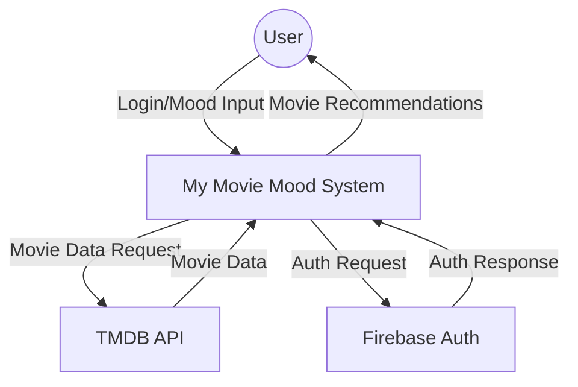
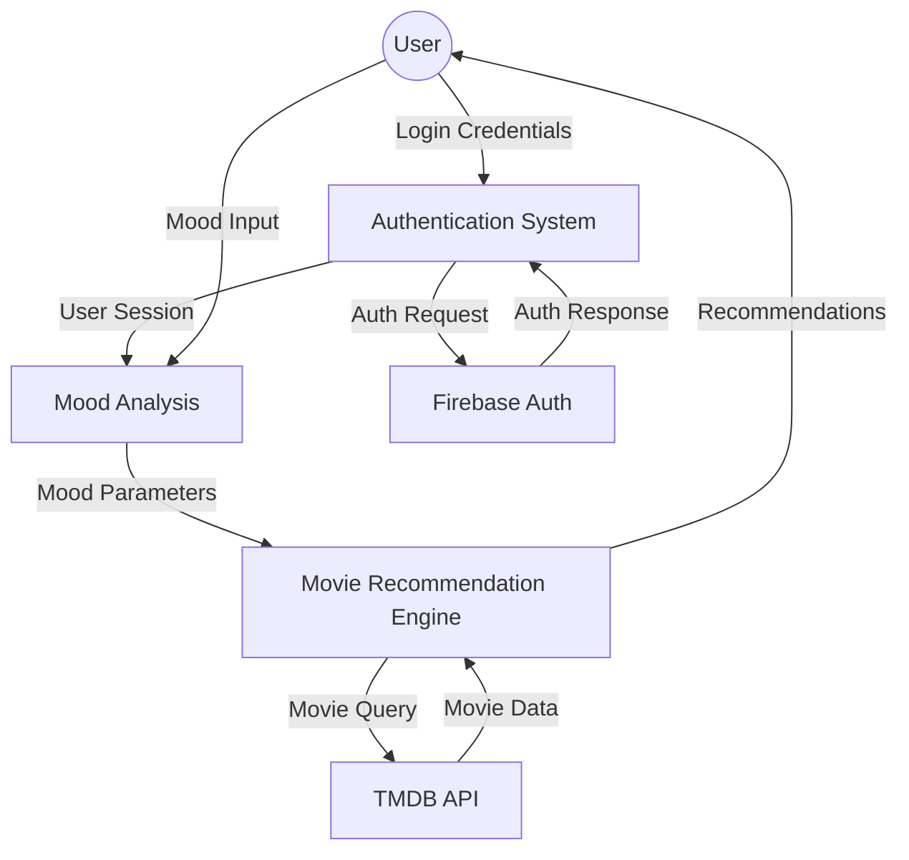
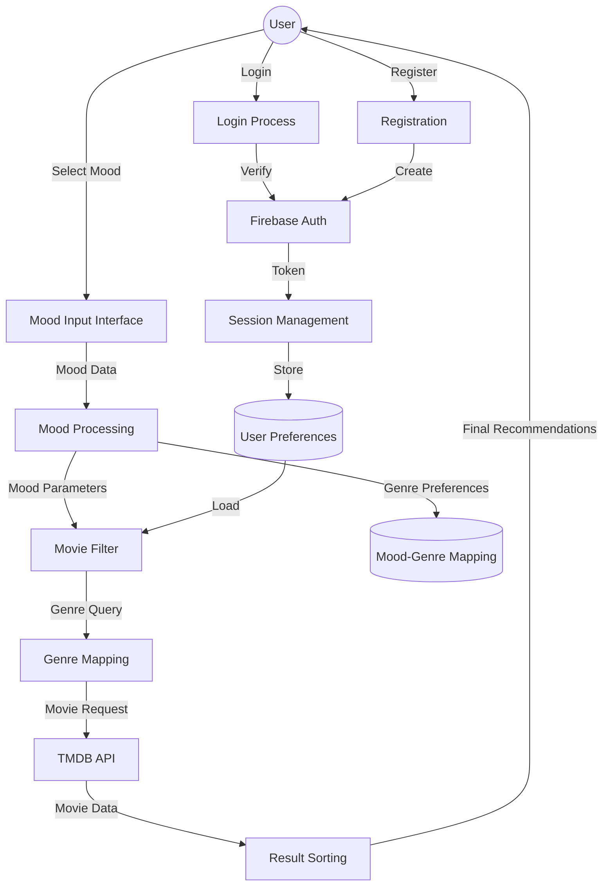
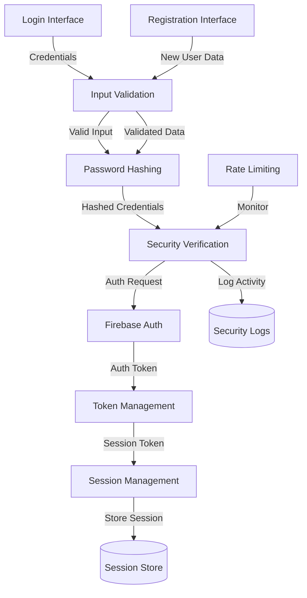
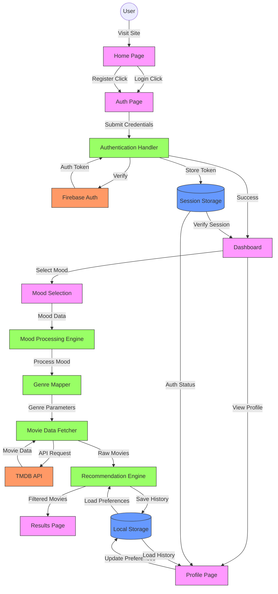

# Data Flow Diagrams (DFD) - My Movie Mood Application

## Level 0 (Context Diagram)

## Level 1 DFD

## Level 2 DFD

## Level 3 DFD - Authentication Subsystem Detail

## Complete Website Data Flow Diagram - My Movie Mood

## Website Data Flow Overview

## Data Flow Description

### 1. Initial Access Flow
- User visits the website
- Home page checks authentication status
- Unauthenticated users are directed to login/register

### 2. Authentication Flow
- User submits credentials
- Firebase validates credentials
- Authentication token stored in session
- User redirected to dashboard

### 3. Mood Selection Flow
- User selects current mood
- Mood processor analyzes selection
- Genre mapper converts mood to genre preferences
- Parameters passed to movie fetcher

### 4. Movie Recommendation Flow
- Movie fetcher queries TMDB API
- Raw movie data processed
- Recommendation engine applies filters
- Results displayed to user

### 5. Profile Management Flow
- User preferences stored locally
- History tracked in local storage
- Profile page displays user data
- Settings affect recommendation algorithm

### 6. Session Management Flow
- Authentication status maintained
- Token validation for protected routes
- Automatic logout on token expiry

### 7. Data Persistence
- User preferences saved locally
- Watch history maintained
- Settings preserved between sessions

## Key Components

### User Interface Components
- **Home Page**: Entry point
- **Auth Page**: Login/Registration
- **Dashboard**: Main user interface
- **Mood Selection**: Mood input interface
- **Results Page**: Movie recommendations
- **Profile Page**: User settings and history

### Processing Components
- **Authentication Handler**: Manages user auth
- **Mood Processing Engine**: Analyzes user mood
- **Movie Data Fetcher**: Interfaces with TMDB
- **Recommendation Engine**: Filters and sorts movies
- **Genre Mapper**: Converts moods to genres

### Data Stores
- **Local Storage**: Persistent user data
- **Session Storage**: Temporary session data

### External Services
- **Firebase Auth**: Authentication service
- **TMDB API**: Movie database

This diagram provides a complete overview of how data flows through your Movie Mood website, from user interaction to data storage and external service integration.

This DFD documentation provides a hierarchical view of your system's data flows, from the highest-level context diagram (Level 0) down to detailed process flows (Level 3). Each level provides increasing detail about specific system components:

- **Level 0**: Shows the system as a single process interacting with external entities
- **Level 1**: Breaks down the main system into major processes
- **Level 2**: Expands each major process into sub-processes
- **Level 3**: Provides detailed process flows for the authentication subsystem

The diagrams use Mermaid syntax for better visualization and can be rendered in any Markdown viewer that supports Mermaid diagrams.
